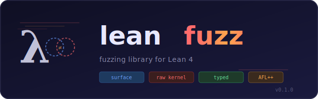

<p align="center">
  
</p>

Grammar-based fuzzing library for Lean 4. Automatically extracts
grammars from parser extension state, generates random
syntactically-guided inputs, and tests user DSLs.

## Grammar-based fuzzing

The core of this library is built around a method `fuzzGrammar`, which
automatically discovers syntax categories registered via
`declare_syntax_cat` in any imported module.

```lean
import LeanFuzz
import Radix

def main (args : List String) : IO Unit :=
  LeanFuzz.fuzzGrammar #[`Radix] `rstmt args
```

```bash
lake exe fuzz-radix --count 1000
```

```
Extracted 20 categories
  rstmt: 8 rules
  rty: 5 rules
  term: 183 rules
  ...
LeanFuzz: fuzzing "grammar:rstmt" (1000 iterations)
  CRASH [0]: parse error: ...
  CRASH [4]: parse error: ...
Done: 1000 iterations, 280 crashes
```

In the case of [Radix](https://github.com/leodemoura/RadixExperiment),
some of the generated programs still crash as the library does
additional checks at elaboration time that aren't captured in the pure
grammar.

This works with any Lean library that defines custom syntax. Just
import the library, name the syntax category, and lean-fuzz handles
the rest.

## Custom fuzz targets

For non-grammar fuzzing, define a `FuzzTarget` directly:

```lean
import LeanFuzz

def target : LeanFuzz.FuzzTarget := {
  name := "json-parser"
  run := fun bytes => do
    let input := String.fromUTF8? bytes |>.getD ""
    let _ := Lean.Json.parse input
}

def main (args : List String) : IO Unit :=
  LeanFuzz.fuzz target args
```

## Setup

Add lean-fuzz to your `lakefile.toml`:

```toml
[[require]]
name = "lean-fuzz"
git  = "https://github.com/<user>/lean-fuzz"
rev  = "main"

[[lean_exe]]
name = "my-fuzzer"
root = "Main"
```

## Grammar export

Dump the extracted grammar for use with AFL++ Grammar Mutator or other
tools:

```bash
lake exe fuzz-radix --dump-grammar json   # full tree-structured JSON
lake exe fuzz-radix --dump-grammar afl    # AFL++ Grammar Mutator format
lake exe fuzz-radix --dump-grammar text   # human-readable text
```

The AFL++ format is a flat CFG where each nonterminal maps to an array
of productions. Token pools from `GenConfig` are emitted as helper
nonterminals so the mutator explores diverse values:

```json
{
  "<rstmt>": [
    ["while ", "(", "<term>", ")", " {", "<_rep_1250>", "}"],
    ["if ", "(", "<term>", ")", " {", "<_rep_1251>", "}", "<_opt_1252>"],
    ["let ", "<_ident>", " : ", "<rty>", " = ", "<term>", ";"],
    ["<_ident>", "[", "<term>", "]", " := ", "<term>", ";"],
    ["return ", "<term>", ";"],
    ["<_ident>", " := ", "<term>", ";"]
  ],
  "<rty>": [
    ["bool"], ["uint64"], ["unit"], ["string"],
    ["<_ident>", " ", "<_ident>", "[]"]
  ],
  "<_ident>": [["x"], ["y"], ["z"], ["a"], ["b"], ["n"], ["m"], ["f"], ["g"], ["h"]],
  "<_num>": [["1"], ["2"], ["42"], ["100"]],
  "<_str>": [["\"hello\""], ["\"world\""], ["\"\""], ["\"test\""]]
}
```

Example grammars for real Lean projects are in
[`examples/grammars/`](examples/grammars/):

| Project | Custom categories | AFL JSON |
|---------|-------------------|----------|
| [RadixExperiment](https://github.com/leodemoura/RadixExperiment) | `rstmt`, `rty` | [radix-afl.json](examples/grammars/radix-afl.json) (3K lines) |
| [Strata](https://github.com/strata-org/Strata) | `tprim`, `tident`, `tcons` | [strata-afl.json](examples/grammars/strata-afl.json) (10K lines) |
| [Veil](https://github.com/verse-lab/veil) | `veilKeyword`, `spec`, `sexp` | [veil-afl.json](examples/grammars/veil-afl.json) (11K lines) |
| [Velvet](https://github.com/verse-lab/velvet) | `stacksTagDB`, `require_caluse` | [velvet-afl.json](examples/grammars/velvet-afl.json) (11K lines) |

## CLI options

```bash
lake exe my-fuzzer                    # standalone: 10000 random inputs
lake exe my-fuzzer --count 50000      # more iterations
lake exe my-fuzzer --seed 42          # deterministic RNG seed
lake exe my-fuzzer --verbose          # print all crashes
lake exe my-fuzzer --replay <file>    # replay a crash file
lake exe my-fuzzer --setup-afl        # generate AFL++ integration scripts
lake exe my-fuzzer --dump-grammar afl # dump grammar for AFL++
./fuzz/run-afl.sh                     # coverage-guided fuzzing with AFL++
```

